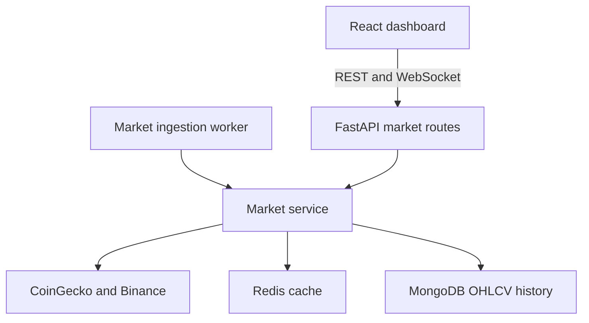

# Architecture through Phase 4

The application is a modular FastAPI backend with a React SPA. A separate market-ingestion process uses the same service/provider/repository modules as the API. Authentication, market data and the Phase 4 prediction backend are implemented. Portfolio/risk management, exchange execution and notifications remain later phases.

## Market data flow

- CoinGecko supplies the top-50 market-cap asset list. Binance supplies normalized OHLCV for supported pairs across `1h`, `4h`, `1d`, `1w`, and `1M`.
- `python -m app.market.workers.ingestion` runs independent price and history loops. Docker Compose starts it as `market-ingestion`.
- Price snapshots refresh every `MARKET_REFRESH_SECONDS` (default 30). Historical ingestion fetches up to `MARKET_HISTORY_CANDLE_LIMIT` (default 200) candles for each asset and interval, then repeats after `MARKET_HISTORY_REFRESH_SECONDS` (default 900).
- Historical writes use an upsert keyed by symbol, interval, and timestamp. An unsupported pair or failed write is logged and retried in the next cycle. A configurable pause between history requests limits request pressure. Shutdown stops new requests and waits for the current bounded provider call.
- Redis caches snapshots, individual latest prices, and candle windows. MongoDB stores durable history; `/api/v1/market/history/{symbol}` reads it without fetching live prices. A history response is explicitly marked `source: mongodb` and may contain older data.
- The REST and WebSocket endpoints share the same market service. The WebSocket sends complete snapshots on the configured cadence and observes disconnects between refreshes. The frontend retains REST polling for recovery.
- Charts and indicators poll using the server's refresh setting. TA-Lib calculates indicators; warm-up periods serialize as null. Chart updates preserve zoom/pan and include candle-volume bars.

## Data ownership and limits

PostgreSQL remains the source of truth for users and future transactional trading state. MongoDB stores market/time-series records. Redis is only a transient cache.

Historical ingestion is a bounded initial backfill plus recurring updates, not an unlimited exchange-history download. Public API rate limits and unsupported Binance pairs can leave gaps; failures are explicit rather than filled with fabricated values. Automated tests mock providers and storage; this phase has not been validated against live provider quotas or a running Docker deployment.

## Delivery

Phase 3 work is confined to `feature/market-data` and reviewed in PR #6. The owner merges into main. SonarQube is deferred by owner request; backend/frontend CI remains active.

## Prediction architecture

The offline `app.prediction.train` worker loads closed, continuous MongoDB candles. Features use only information available at each candle close. Chronological train/validation/test splits purge boundary labels, and preprocessing is fitted on training windows only. The worker trains a Random Forest direction classifier, an XGBoost return regressor and a TensorFlow/Keras LSTM return forecaster.

The regressors are combined with fixed equal weights; their next-return forecasts convert to prices using the last close. Test data is evaluated once without fitting any parameters. Validation data supplies the reported empirical 95th-percentile absolute error; it is not a calibrated prediction interval. Long/cash backtesting delays execution by one bar and includes transition fees and final liquidation.

Immutable operator-created model bundles live in a shared artifact volume. The existing PostgreSQL `ml_models` table stores bundle versions, checksums, split metadata, metrics and active-version status. Activation is explicit and serialized per symbol/interval. Forecasts are recorded in the existing `predictions` table. Redis remains a market cache and is not used as the model registry.

Authenticated prediction endpoints load the active version, verify file checksums and library versions, and check feature/provider/quote compatibility and candle freshness. The API volume is mounted read-only; the training process writes bundles. Models are cached by immutable version after verification. No HTTP endpoint trains, uploads or activates a model.

Phase 4 confidence is an uncalibrated classifier probability. Estimated risk is recent candle-return volatility. Ranking is a transparent expected-return/probability/volatility heuristic. These outputs do not authorize trades or establish profitability. CI validates small real model training on synthetic fixtures and PostgreSQL registry behavior; production training and market performance evaluation require real history.
