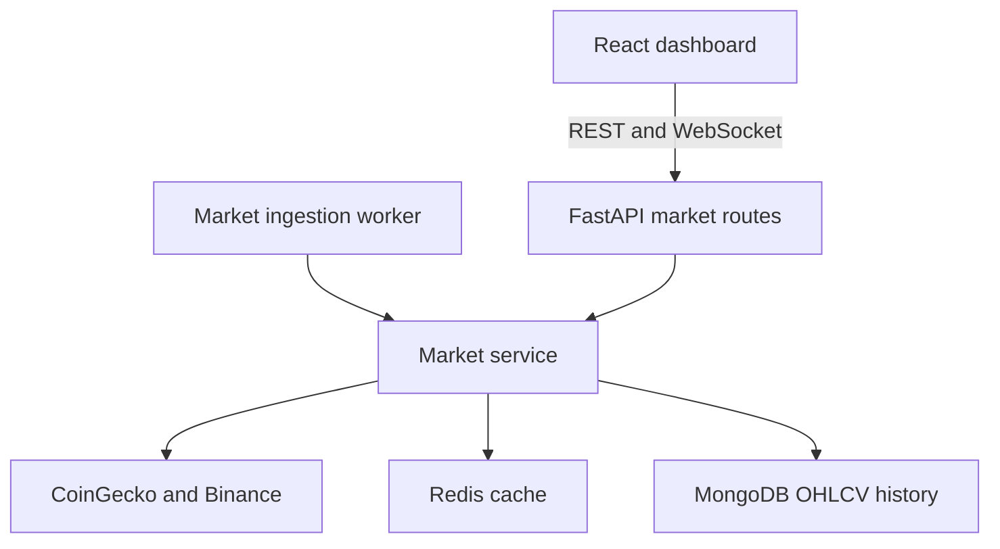

# Architecture through Phase 3

The application is a modular FastAPI backend with a React SPA. A separate market-ingestion process uses the same service/provider/repository modules as the API. Authentication and market data are implemented; prediction, portfolio/risk, exchange execution, and notifications remain later phases.

## Market data flow

- CoinGecko supplies the top-50 market-cap asset list. Binance supplies normalized OHLCV for supported pairs across `1h`, `4h`, `1d`, `1w`, and `1M`.
- `python -m app.market.workers.ingestion` runs independent price and history loops. Docker Compose starts it as `market-ingestion`.
- Price snapshots refresh every `MARKET_REFRESH_SECONDS` (default 30). Historical ingestion fetches up to `MARKET_HISTORY_CANDLE_LIMIT` (default 200) candles for each asset and interval, then repeats after `MARKET_HISTORY_REFRESH_SECONDS` (default 900).
- Historical writes use an upsert keyed by symbol, interval, and timestamp. An unsupported pair or failed write is logged and retried in the next cycle. A configurable pause between history requests limits request pressure. Shutdown stops new requests and waits for the current bounded provider call.
- Redis caches snapshots, individual latest prices, and candle windows. MongoDB stores durable history; `/api/v1/market/history/{symbol}` reads it without fetching live prices. A history response is explicitly marked `source: mongodb` and may contain older data.
- The REST and WebSocket endpoints share the same market service. The WebSocket sends complete snapshots on the configured cadence and observes disconnects between refreshes. The frontend retains REST polling for recovery.
- Charts and indicators poll using the server's refresh setting. TA-Lib calculates indicators; warm-up periods serialize as null. Chart updates preserve zoom/pan and include candle-volume bars.

## Data ownership and limits

PostgreSQL remains the source of truth for users and future transactional trading state. MongoDB stores market/time-series records. Redis is only a transient cache.

Historical ingestion is a bounded initial backfill plus recurring updates, not an unlimited exchange-history download. Public API rate limits and unsupported Binance pairs can leave gaps; failures are explicit rather than filled with fabricated values. Automated tests mock providers and storage; this phase has not been validated against live provider quotas or a running Docker deployment.

## Delivery

Phase 3 work is confined to `feature/market-data` and reviewed in PR #6. The owner merges into main. SonarQube is deferred by owner request; backend/frontend CI remains active.
